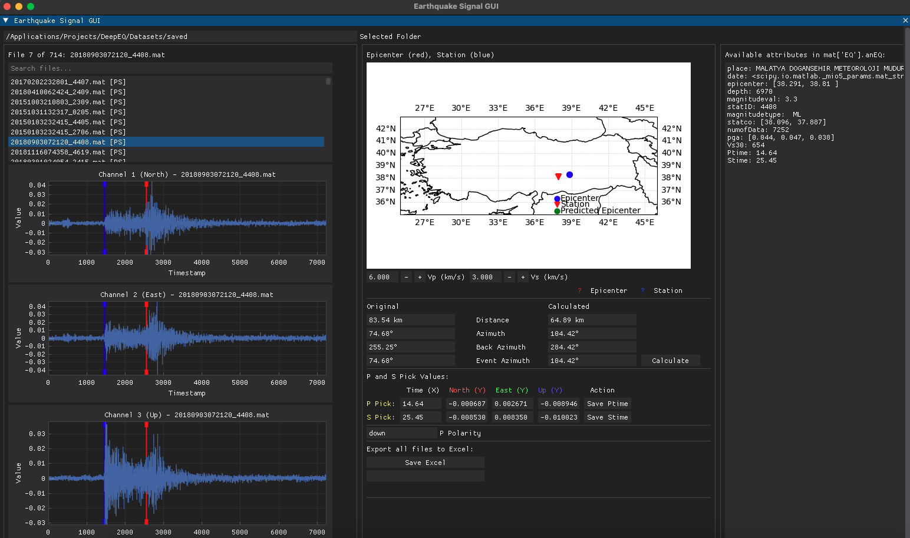

# Earthquake Signal GUI

[](https://www.python.org/downloads/)
[](https://github.com/hoffstadt/DearPyGui)
[](LICENSE)

Gelişmiş deprem sinyali analizi için interaktif bir GUI. MATLAB (.mat) dosyalarından P/S pick, polarite, azimut ve epicenter tahmini; Türkiye haritası üzerinde görselleştirme ve Excel çıktısı.

---

- [Özellikler](#özellikler)
- [Hızlı Başlangıç](#hızlı-başlangıç)
- [Ekran Görüntüsü](#ekran-görüntüsü)
- [Veri Formatı ve Örnekler](#veri-formatı-ve-örnekler)
- [Dizin Yapısı](#dizin-yapısı)
- [Teknik Notlar](#teknik-notlar)
- [Roadmap](#roadmap)
- [FAQ](#faq)
- [English Summary](#english-summary)

## Özellikler

- Çoklu kanal (North, East, Up) sinyal görselleştirme
- P/S dalga işaretleme (drag-line) ve otomatik senkronizasyon
- P polarite tespiti ve olay azimutu hesaplama
- S-P mesafesi ve epicenter tahmini (harita üzerinde)
- Dosya arama/filtreleme ve durum göstergeleri (P/S mevcut mu)
- Toplu Excel çıktı alma

## Hızlı Başlangıç

1) Ortamı kurun
```bash
pip install -r requirements.txt
```

2) Örnek verileri `sample_data/` içine ekleyin (.mat)
- En az 5 kayıt önerilir. İsim önemli değil.
- Uygulama varsayılan olarak `sample_data/` klasörünü kullanır.

3) Uygulamayı başlatın
```bash
python earthquake_signal_gui.py
```

## Ekran Görüntüsü

Repository’e kendi görüntünüzü ekleyin ve yolunu aşağıdaki gibi bırakın:

```markdown

```

- Görseli `assets/screenshot.png` olarak eklemeniz yeterli.

## Veri Formatı ve Örnekler

- .mat dosyası yapısı (desteklenen iki varyanttan biri yeterlidir):
  - `EQ.anEQ.Accel` (Nx3), `EQ.anEQ.Ptime`, `EQ.anEQ.Stime`, `EQ.anEQ.epicenter [lat,lon]`, `EQ.anEQ.statco [lat,lon]`
  - veya doğrudan `anEQ` altında aynı alanlar
- Ayrıntı ve alan listesi için: `sample_data/README.md`

Notlar:
- `DEFAULT_FOLDER` kodda `sample_data` olarak ayarlı.
- `sample_data/*.mat` dosyaları versiyona dahil edilir; onun dışındaki `.mat` dosyaları `.gitignore` ile hariçtir.

## Dizin Yapısı

```
.
├── earthquake_signal_gui.py    # Ana GUI uygulaması
├── requirements.txt            # Bağımlılıklar
├── README.md                   # Bu dosya
├── LICENSE                     # MIT Lisansı
├── .gitignore                  # Git ignore
├── assets/
│   └── (screenshot.png)        # Ekran görüntüsü (siz ekleyeceksiniz)
├── sample_data/
│   └── README.md               # Veri formatı açıklaması
└── (earthquake_analysis_results.xlsx)  # Çıktı, git tarafından ignore
```

## Teknik Notlar

- Harita çizimi için `cartopy` kullanılır. İlk açılışta `turkey_map.png` dosyası oluşturulur/güncellenir.
- Excel çıktı: çalışma dizinine `earthquake_analysis_results.xlsx` olarak kaydedilir.
- P/ S seçimleri `.mat` içindeki `anEQ` yapısına yazılabilir (Save Ptime / Save Stime).

## Roadmap

- Çoklu istasyon karşılaştırma görünümü
- Gelişmiş filtreleme ve bant sınırlama seçenekleri
- Farklı hız modelleri ve S-P mesafesi için konfigürasyon profilleri
- Hafif veri önizleme (devasa .mat dosyalarında)

## FAQ

- Harita görünmüyor: `cartopy` kurulumunu ve PROJ/GEOS bağımlılıklarını kontrol edin.
- Dosya listesi boş: `.mat` dosyaları `sample_data/` klasöründe olmalı ve doğru alanlara sahip olmalı.
- Excel butonu sonuç üretmiyor: Yazma izni ve bağımlılıkları (`openpyxl`) kontrol edin.

---

## English Summary

An interactive GUI for earthquake signal analysis from MATLAB (.mat) files. Provides P/S picking, polarity, azimuth, epicenter estimation on a Turkey map, and Excel export.

- Multi-channel visualization (N/E/U)
- P/S picking with synchronized cursors
- P polarity and event azimuth
- S-P distance and epicenter estimation
- Search/filter with P/S status
- Excel export

Quick start:
```bash
pip install -r requirements.txt
python earthquake_signal_gui.py
```
Add your `.mat` files into `sample_data/` and an optional screenshot at `assets/screenshot.png`.
